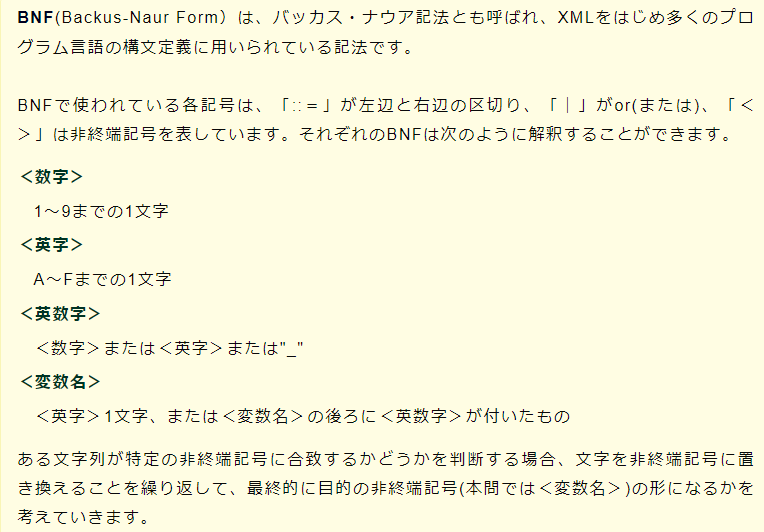
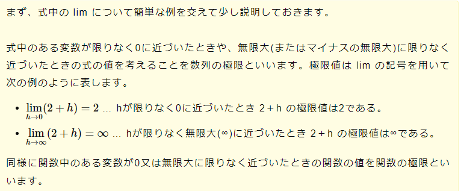

# 基礎理論
## ハフマン符号化
  - 出現確率が高いデータには短い符号を、低いデータには長い符号を与えることで圧縮を効率よく行う方法

## 機械学習
コンピュータに大量の学習データを与え、数学的アプローチによって自律的にデータの特徴点を見出して、**コンピュータに人間のようなパターン認識や分類能力を持たせる**AIの分野

## ディープラーニング
人間や動物の脳神経をモデル化したアルゴリズム(**ニューラルネットワーク**)を多層化したものを用意し、それに「**十分な量のデータを与えることで、人間の力無しに自動的に特徴点やパターンを学習させる**」ことを言う。

[図の線上を，点Pから点Rを通って，点Qに至る最短経路は何通りあるか。](https://www.ap-siken.com/kakomon/20_aki/q5.html)

Combination(確率の数式を使う)
P-Rまでの最短は上に2回、右に2回(合計4回移動)、かつ上と右に移動という2種類ということが分かる。

nCr
というのは
nから数を下げながらr個の掛け算 / 1から数を上げながらr個の掛け算

₄C₂の場合
4から数を下げながら2個の掛け算 / 1から数を上げながら2個の掛け算
4*3 / 1*2 -> 12 / 2 -> 6

R-Qの最短の計算
上に2回、右に3回移動、かつ上と右の移動の2種類
₅C₂
5*4 / 1*2 -> 20/2 -> 10

最終的に P-R-Qまでの最短は
6 * 10 -> 60通り

[ある整数値を，負数を2の補数で表現する2進表記法で表すと最下位2ビットは"11"であった。10進表記法の下で，その整数値を4で割ったときの余りに関する記述として，適切なものはどれか。ここで，除算の商は，絶対値の小数点以下を切り捨てるものとする。](https://www.fe-siken.com/kakomon/30_haru/q1.html)

最下位2ビットが11の場合
例:
111 -> 7
1011 -> 11
1111 -> 15
10011 -> 19

4で割った余りを出す
n % 4 -> 全て3が出る
=> 正の整数の場合は全て3

負の数を考える
負の数への変換
1. 2進数値から1を引く
2. 全てのビットを反転させる

最下位2ビットに当てはめる
1. 11 -> 10
2. 10 -> 01

最下位2ビットが01に当てはまる数値を考える

例:
101(5) -> -5 % 4 -> -1
1001(9) -> -9 % 4 -> -1
10101(21) -> -21 % 4 -> -1
110001(49) -> -49 % 4 -> -1

負ならば-1になる。

### 指定の2進数への導き方
110001
1+0+0+0+16+32 ->49
桁の重みの足し算で楽にできる。

## BNF
バッカス・ナウア記法

[次に示す手順は，列中の少なくとも一つは1であるビット列が与えられたとき，最も右にある1を残し，他のビットを全て0にするアルゴリズムである。例えば,00101000が与えられたとき,00001000が求まる。aに入る論理演算はどれか。](https://www.fe-siken.com/kakomon/18_aki/q8.html)

- XOR回路とは
  - 2つある入力のうち「片方だけが1」の場合に1となる論理演算

1) 00101000(A)とする が与えられる
2) -1 をし、結果をBとする -> 00100111(B)
3) A XOR B -> bitを比べ、どちらかが1のものを1とし、両方が同じ数値は0とする -> 00001111(C)
4) AとCを比較する
   1) 00101000(A)
   2) 00001111(C)
5) CがAとなるためには、AとCの値が同じ個所だけ1とし、数値が異なる場合は0とする　ということが分かる。
6) よってAND(論理積)で求められるということがわかる。

[10進数の演算式7÷32の結果を2進数で表したものはどれか。](https://www.fe-siken.com/kakomon/27_aki/q1.html)

1. まず 7 / 32 を求める -> 0.21875
2. 0.21875は10進数なので、これを2進数へ変換する
   1. 小数点以下を *2　していき、小数点数値が2進数へと変換できる
   2. 0.21875 * 2 -> 0.5~ => 0
   3. 0.1875 * 2 -> 0.3~ => 0
   4. 0.875 * 2 -> 1.~ => 1
   5. 0.75 * 2 -> 1.5 => 1
   6. 0.5 * 2 -> 1.0 => 1
3. 0.00111

(違うやり方)
1. 7 / 32 -> 重みで考えると 1/32 + 2/32 + 4/32 と表記できる
2. 約分する
   1. 1/32 + 1/16 + 1/8
   2. 1/2⁵ + 1/2⁴ + 1/2³
3. 2進少数で表す(0.3桁目, 0.4桁目, 0.5桁目に1が付く)
   1. 0.00111

(更に別解)
7/32 の7と32をそれぞれ2進数に変換する
7 -> 111
32 -> 100000　=> 1*2⁵
111 / 100000
111を5桁分小数点にずらす。
1. 11.1
2. 1.11
3. 0.111
4. 0.0111
5. 0.00111

[Random(n)は，0以上n未満の整数を一様な確率で返す関数である。整数型の変数A，B及びCに対して次の一連の手続を実行したとき，Cの値が0になる確率はどれか。](https://www.ap-siken.com/kakomon/20_aki/q4.html)

A 1~10 10通り
B 1~10 10通り
AとBで合わせると　10*10 -> 100通り

A-B=0 となるのはAとBが同じ値の時に起こる
1-1=0, 2-2=0,...
1~10の数値の時 -> 10通り

100通り分の10通り
10 / 100 -> 1/10

[最上位をパリティビットとする8ビット符号において，パリティビット以外の下位7ビットを得るためのビット演算はどれか。](https://www.fe-siken.com/kakomon/18_haru/q6.html)

問題を読み解く)
例として、11101011というデータにおいて、パリティビットは最上位の1で、それ以下7ビットの数値が得たいというもの。
1101011

11101011という数値から最上位ビットを取り除き、
01101011というデータが得たいということ。(コンピュータの中ではデータをバイト単位で扱うので、取り除いた後に最上位に再び0を足す)

11101011　から
01101011　を得るビット演算をすれば良いということになる。

例で出した数値なので、数値は決まってるわけではないので、

Y X1 X2 X3 X4 X5 X6 X7
0 X1 X2 X3 X4 X5 X6 X7
というビット列を取り出す操作をしたいということ。

上から下を得るにはAND演算で求められるということがわかる。
(上下が一致している場合にその数値を返す)

上下が一致している場合に数値を返す -> 1を返すということなので、
01111111

これを16進数に直す
4ビット区切りにするので、
0111, 1111
0111 -> 7
1111 -> F

7Fということになる。

数式を組み、tに10や100などの数値を入れて検証すると、分子の増加量よりも分母の増加量の方が多いことがわかることから、0に限りなく近づいていくことがわかる。

## 機械学習
- 教師あり学習
  - データと正解をセットにして与える(もしくは誤りを指摘する)手法
